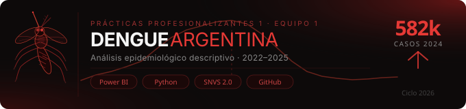

<div align="center">
  
</div>

<br/>

<div align="center">


</div>

---

## 📌 Descripción del Proyecto

Este repositorio contiene el desarrollo completo del proyecto de **Salud Pública** trabajado por el Grupo 1 en el marco de Prácticas Profesionalizantes 1.

El proyecto simula un ambiente de trabajo profesional real, organizado en **3 Sprints** a lo largo del cuatrimestre, aplicando metodologías ágiles, análisis de datos y documentación técnica.

> 🦟 **Problemática abordada:** Análisis epidemiológico del dengue en Argentina (2022–2025). Se estudian patrones temporales, distribución geográfica y grupos etarios afectados, con el objetivo de construir un monitor de alerta epidemiológica basado en datos del SNVS 2.0 y datos climáticos del SMN.

---

## 👥 Integrantes del Equipo

| Nombre | Rol |
|--------|-----|
| Amir Kalasnicov | Visualización / Power BI |
| Juan Pablo Monllor · [@juanpablomonllor](https://github.com/juanpablomonllor) | Comunicador / Coordinador |
| Lionel Martínez | Documentación / Retrospectivas |
| Tamara Roa López | Delivery Lead / Power BI |

**Docentes supervisores:** Martín Mirabete · Silvana Páez Jiménez

---

## 🗺️ Estructura del Repositorio

```
📦 pp1-grupo1-salud/
│
├── 📁 assets/
│   ├── banner.svg
│   └── social-preview.svg
│
├── 📁 sprint_1/
│   ├── documentacion/
│   │   ├── ficha_dominio.docx
│   │   ├── ambito_desarrollo.docx
│   │   └── carta_presentacion.pdf
│   ├── planificacion/
│   │   ├── diagrama_gantt.xlsx
│   │   └── herramientas.md
│   └── entregables/
│
├── 📁 sprint_2/
│   ├── analisis/
│   │   ├── EDA_inicial.docx
│   │   └── reporte_insights.docx
│   ├── datos/
│   │   ├── raw/
│   │   │   ├── dataset_dengue_2022.csv
│   │   │   ├── dataset_dengue_2023.csv
│   │   │   ├── dataset_dengue_2024.csv
│   │   │   └── dataset_dengue_2025.csv
│   │   └── processed/
│   │       ├── dataset_dengue_limpio_copia.csv
│   │       ├── smn_semanal_provincia.csv
│   │       └── tasa_provincia_grupo_etario_RENAPER.csv
│   └── entregables/
│
├── 📁 sprint_3/
│   ├── dashboards/
│   │   ├── MACRO_DASHBOARD_1.pbix   ← Evolución temporal
│   │   ├── MACRO_DASHBOARD_2.pbix   ← Distribución geográfica
│   │   ├── MICRO_DASHBOARD_CLIMA.pbix ← Clima × semanas epidemiológicas
│   │   └── MICRO_DASHBOARD_1.pbix   ← Incidencia por grupo etario
│   ├── presentacion/
│   │   └── storytelling_dengue.pptx
│   └── entregables/
│
├── 📁 recursos/
│   └── referencias.md
│
└── README.md
```

---

## 📊 Fuentes de Datos

| Dataset | Fuente | Descripción |
|---------|--------|-------------|
| `dataset_dengue_2022-2025.csv` | SNVS 2.0 (datos.gob.ar) | Casos de dengue por departamento, semana epidemiológica y grupo etario |
| `smn_semanal_provincia.csv` | SMN | Temperatura, humedad y precipitación agregados por semana epi. y provincia |
| `tasa_provincia_grupo_etario_RENAPER.csv` | RENAPER (construcción propia) | Tasas de incidencia cada 100k hab. por provincia y grupo etario — 2024 |

---

## 🚀 Plan de Sprints

### ✅ Sprint 1 — Organización, Planificación y Documentación Base
> 📅 4 al 10 de mayo de 2026

**Objetivos:**
- Conformación del equipo y asignación de roles
- Configuración del entorno de trabajo (GitHub, Drive, Trello)
- Definición del problema de Salud Pública: dengue en Argentina
- Elaboración de la ficha de dominio, diccionario de datos y carta de presentación

**Entregables:**
- [x] Ficha de conocimiento del dominio (10 preguntas de investigación)
- [x] Ámbito de desarrollo del proyecto
- [x] Diagrama de Gantt
- [x] Carta de presentación del equipo
- [x] Repositorio configurado y README inicial
- [x] Minutas de reunión

---

### ✅ Sprint 2 — Análisis Exploratorio de Datos (EDA)
> 📅 11 al 31 de mayo de 2026 (3 semanas)

**Objetivos:**
- Recolección, limpieza y normalización de los 4 datasets anuales de dengue (SNVS 2.0)
- Integración de datos climáticos del SMN (temperatura, humedad, precipitación)
- Construcción de tasas de incidencia por provincia y grupo etario (RENAPER)
- EDA completo con identificación de hallazgos y construcción de visualizaciones iniciales

**Entregables:**
- [x] Dataset limpio e integrado (`dataset_dengue_limpio_copia.csv`)
- [x] Registro de limpieza y normalización
- [x] EDA inicial documentado
- [x] Reporte de insights (mínimo 3 hallazgos significativos)
- [x] Documento técnico de cierre Sprint 2

---

### ✅ Sprint 3 — Dashboards, Storytelling y Presentación Final
> 📅 1 al 7 de junio de 2026 (1 semana)

**Objetivos:**
- Construcción del suite de dashboards en Power BI (4 dashboards)
- Elaboración del storytelling con estructura de 5 actos
- Síntesis de hallazgos y conclusiones orientadas a la problemática epidemiológica
- Presentación final con exposición oral

**Entregables:**
- [x] Dashboard Macro 1: Evolución temporal (2022–2025)
- [x] Dashboard Macro 2: Distribución geográfica por provincia y departamento
- [x] Dashboard Micro 1: Clima × semanas epidemiológicas (heatmaps Deneb)
- [x] Dashboard Micro 2: Incidencia por grupo etario y provincia
- [x] Presentación storytelling (10 slides, estructura 5 actos)
- [x] Repositorio completo y documentado

---

## 🔍 Hallazgos Principales

| # | Hallazgo |
|---|----------|
| 01 | **Pico sistemático en semanas 12–14** en todos los años analizados; coincide temporalmente con temperaturas de 18–23°C y humedad de 70–91% |
| 02 | **2024: brote de escala excepcional** — ~582.000 casos, equivalente al 78% del total acumulado 2022–2025 |
| 03 | **El norte lidera en incidencia normalizada:** Tucumán registra ~6.410 casos/100k hab. vs. 702/100k en Buenos Aires, invirtiendo la lectura de volúmenes absolutos |
| 04 | **El grupo 25–34 años lidera en tasa de incidencia;** el grupo 45–65 años lidera en cifras absolutas — el mismo patrón de inversión que en geografía |
| 05 | **Densidad poblacional no explica la incidencia:** el scatter plot no muestra correlación directa; el patrón parece más asociado a condiciones territoriales del norte del país |

> ⚠️ **Nota metodológica:** Las tasas por grupo etario (RENAPER) cubren únicamente enero–abril 2024. La serie climática de marzo 2025 es parcial (~9 de 31 días disponibles en SMN).

---

## 🛠️ Stack Tecnológico

| Herramienta | Uso |
|-------------|-----|
| 🐍 Python / Pandas | Limpieza, ETL y construcción de tasas (RENAPER) |
| 📊 Power BI + Deneb | Suite de dashboards y visualizaciones Vega-Lite |
| 🔄 Power Query M | Integración y transformación de datos SMN |
| 📓 Node.js (`docx`) | Generación de documentación técnica en Word |
| 🐙 GitHub | Control de versiones |
| 📋 Trello | Gestión ágil de tareas por sprint |
| 📁 Google Drive | Almacenamiento compartido del equipo |
| 📞 Google Meet / WhatsApp | Comunicación y reuniones del equipo |

---

## 📌 Links del Equipo

| Recurso | Link |
|---------|------|
| 📋 Tablero Trello | [Equipo N°1 PP1 – Salud / Epidemiología](https://trello.com/b/JYGHSrVV/equipo-n1-pp1-salud-epidemiologia-1c-2026) |
| 📁 Google Drive | [Carpeta compartida del equipo](https://drive.google.com/drive/u/1/folders/1HN42dRPN4jW6x2imbno27WZDj_QI5sEh) |
| 📊 Diagrama de Gantt | [Gantt en Notion](https://app.notion.com/p/35b6eb822dc480bcbca8f49a4478db4e?v=35b6eb822dc4809fa3e8000c6b945600) |
| 💬 Grupo WhatsApp | *(privado)* |

---

## 🤝 Convenciones de Trabajo

### 🌿 Ramas (Branches)
```
main            ← Código estable y entregables finales
dev             ← Integración del equipo
sprint-1        ← Trabajo del Sprint 1
sprint-2        ← Trabajo del Sprint 2
sprint-3        ← Trabajo del Sprint 3
feature/xxx     ← Funcionalidades específicas
fix/xxx         ← Correcciones
```

### 💬 Formato de Commits
```
✅ feat:  nueva funcionalidad
📝 docs:  documentación
🧹 clean: limpieza de datos
📊 eda:   análisis exploratorio
🐛 fix:   corrección de errores
🚀 final: entregable listo
```

---

## 📅 Cronograma

| Sprint | Período | Duración | Estado |
|--------|---------|----------|--------|
| Sprint 1 | 4 – 10 de mayo de 2026 | 1 semana | ✅ Completado |
| Sprint 2 | 11 – 31 de mayo de 2026 | 3 semanas | ✅ Completado |
| Sprint 3 | 1 – 7 de junio de 2026 | 1 semana | ✅ Completado |

---

## 📄 Licencia

[](https://creativecommons.org/licenses/by-nc-sa/4.0/)

Proyecto académico — Prácticas Profesionalizantes 1 · Tecnicatura Superior en Ciencia de Datos e Inteligencia Artificial · Centro Politécnico Superior Malvinas Argentinas · 2026.  
Uso permitido únicamente con fines académicos, citando a los autores originales.

---

<div align="center">
  🦟 Grupo 1 · Epidemiología del Dengue · PP1 · 2026 &nbsp;·&nbsp; Hecho con 💪 y mucho ☕
</div>
